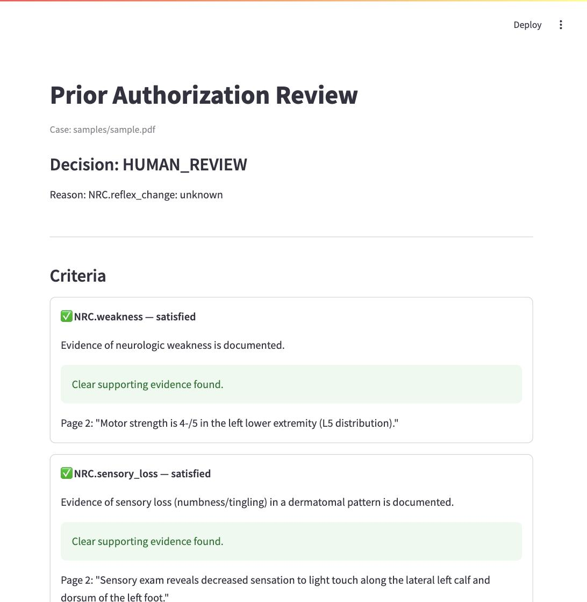

# Prior Authorization Document Intelligence

A document intelligence project that uses an LLM to find evidence inside clinical documents and maps that evidence to predefined review criteria.

The project focuses on one narrow example: **lumbar spine MRI prior authorization**.

Instead of asking an LLM to make the final decision, the system separates the workflow into two parts:

- **LLM:** reads the documents and finds relevant evidence.
- **Deterministic code:** verifies the evidence and applies explicit workflow rules.

The result is a reviewer-facing summary that shows:

**criterion → status → page → exact supporting evidence**

> **Disclaimer:** This is a portfolio project built with synthetic patient data and simplified educational criteria. It is not a clinical system, medical device, or real payer policy implementation, and should not be used for medical or coverage decisions.

---

## The Problem

A prior authorization review can involve multiple documents containing information relevant to a requested service.

For example, a reviewer evaluating a lumbar spine MRI request may need to look through physician notes, treatment history, and physical therapy records to determine whether specific review criteria are documented.

The relevant information may be spread across different pages and written in different ways.

This project explores a simple question:

> **Can an LLM find the relevant evidence and show a reviewer exactly where it came from, while keeping the final workflow logic outside the model?**

---

## How It Works

```text
Synthetic PDF packet
        |
        v
1. Extract text page by page
   app/extract_text.py
        |
        v
2. Load review criteria
   app/policy.py
   policies/lumbar_mri.json
        |
        v
3. Find evidence for each criterion using an LLM
   app/evidence.py
        |
        v
4. Verify returned quotes against the source page
        |
        v
5. Apply deterministic decision rules
   app/decision.py
        |
        v
6. Present the results to the reviewer
   app/review_ui.py
```

The language model is used for **document understanding**, not for making the final workflow decision.

---

## Evidence Results

Each review criterion receives one of three statuses:

| Status | Meaning |
|---|---|
| `satisfied` | Clear supporting evidence was found |
| `not_found` | Supporting evidence was not found in the submitted documentation |
| `unknown` | The available documentation is not clear enough to make a reliable determination |

When a criterion is `satisfied`, the system also returns the page number and exact supporting text.

For example:

```json
{
  "criterion_id": "NRC.weakness",
  "status": "satisfied",
  "page_number": 2,
  "quote": "Motor strength is 4-/5 in the left lower extremity."
}
```

The returned quote is checked against the extracted text from the cited page before it is accepted.

This gives the reviewer a direct path from:

```text
criterion
    ↓
status
    ↓
page
    ↓
source evidence
```

For most criteria, `satisfied` requires the actual finding to be
*present* in the record - a statement that explicitly denies or rules
out a finding is `not_found`, not `satisfied`. A small number of
criteria are marked `is_concern_criterion: true` in the policy file
(`RF.red_flag`, `NRC.bowel_bladder`) because their own description
genuinely allows two readings of "satisfied" - the concerning finding
was explicitly ruled out, or it is actually present. For those
criteria only, the evidence report also carries a `concern_present`
flag distinguishing the two. Which criteria get this treatment is a
deterministic fact set in policy data, not something the model infers
per call - see [Evaluation](#evaluation) below for why that matters.

---

## Decision Logic

After all criteria have been evaluated, a separate deterministic
function applies the workflow rules.

Criteria are grouped in the policy file (`policies/lumbar_mri.json`)
so that alternative ways to satisfy the same requirement - any one of
four neuro findings, either medication or physical therapy for
conservative care - don't each have to be individually satisfied. A
group is met if at least one of its members is `satisfied`. A
criterion with no listed group is its own singleton group.

| Evidence results | Outcome |
|---|---|
| Every group has at least one `satisfied` member, and no red-flag-style criterion has its concerning finding actually present | `APPROVE` |
| Any group has no `satisfied` member, OR any red-flag-style criterion's concerning finding is actually present | `HUMAN_REVIEW` |

A red-flag / warning-sign finding that is actually present in the
record always forces `HUMAN_REVIEW`, regardless of every other
criterion - it is never a bypass to approval and never an automatic
denial, matching real prior-authorization practice: a red flag is a
signal for closer review, not a shortcut either way.

The LLM does **not** make this final decision. This separation keeps
the workflow logic explicit and independently testable.

---

## Reviewer UI

The reviewer interface displays the final recommendation along with the evidence found for each criterion.



For satisfied criteria, the reviewer can see the supporting quote and page number without manually searching through the entire packet.

---

# Demo Case: Jane Synthetic-Doe

The repository includes a fully synthetic example that demonstrates the pipeline from document ingestion to reviewer output.

### Case

**Patient:** Jane Synthetic-Doe
**Date of birth:** 01/01/1990
**Requested service:** Lumbar spine MRI
**Presenting complaint:** Low back pain radiating to the left leg for 8 weeks
**Input:** `samples/sample.pdf`

The sample is a four-page synthetic packet containing:

- Referral information
- Physician examination notes
- Medication and treatment history
- Physical therapy notes

The packet intentionally contains a mixture of **clear, missing, and uncertain information** so that the pipeline exercises more than a simple all-criteria-satisfied case.

---

## What the System Finds

The demo policy evaluates all 10 lumbar MRI criteria against the submitted documentation.

### Satisfied

- **7 criteria satisfied** — neurologic weakness, sensory loss,
  medication trial, physical therapy, treatment duration, symptom
  duration, and bowel/bladder dysfunction (explicitly ruled out) are
  all directly documented, each with the exact supporting sentence and
  page number a reviewer can check in seconds.

Example:

```text
Neurologic Weakness
SATISFIED

Page 2

"Motor strength is 4-/5 in the left lower extremity."
```

---

### Not Found

- **1 criterion not_found** — no prior imaging is on file.

This means evidence was **not found in the submitted documentation**. It does not claim that the information does not exist elsewhere.

---

### Unknown

- **1 criterion unknown** — the physician note states the reflex
  examination was:

  > "deferred due to patient guarding"

  meaning it was never actually performed. The system correctly
  distinguishes "this exam wasn't done" from "this exam was done and
  found nothing" - a real judgment call, not just pattern matching.
  (Earlier in development the model got this wrong and called it
  `not_found`; the prompt instructions were fixed to correct it.)

This demonstrates an important distinction in the pipeline:

> **Evidence that is missing and evidence that cannot be reliably interpreted are not treated as the same thing.**

---

## Demo Outcome

For the included sample case, the deterministic decision engine produces:

### `HUMAN_REVIEW`

Triggered by the one `unknown` reflex-exam criterion. A person needs
to look at *why* the reflex exam wasn't performed before this case can
be routed anywhere else - a judgment call the system correctly refuses
to make on its own.

The important part is that the model itself does not decide:

```text
"HUMAN_REVIEW"
```

Instead:

```text
Clinical documents
        ↓
LLM finds evidence
        ↓
Structured criterion statuses
        ↓
Deterministic grouping + rules
        ↓
HUMAN_REVIEW
```

Opening the reviewer UI, a reviewer sees this decision immediately at
the top, then can scan all 10 criteria in seconds - for the 7
satisfied ones, the exact quote and page number are right there to
verify, instead of re-reading 4 pages of clinical notes by hand.

---

## Evaluation

Building the decision engine surfaced a question no amount of code
review answers on its own: how much can the evidence-finding step
actually be trusted? `app/run_eval.py` runs the real pipeline (real
Claude API calls, no mocking) against five ground-truth synthetic
packets (`app/eval_cases.py`) and scores three things:

- **per-criterion status accuracy** — did the model's status match
  human-judged ground truth
- **decision accuracy** — did the deterministic engine reach the right
  final outcome
- **hallucination count** — any `satisfied` where ground truth says
  `not_found`/`unknown`, which must always be 0. One packet
  (`sample_offtopic.pdf`) is a grocery list and a weather forecast —
  zero clinical content at all — specifically to check the model
  doesn't invent medical evidence out of unrelated text.

Current state: **5/5 decisions correct, 50/50 (100%) criterion
accuracy, 0 hallucinations.**

### What the eval caught along the way

The eval wasn't just a final scorecard — it caught two real bugs
before this state was reached, both fixed by moving a judgment call
out of the LLM prompt and into deterministic policy data, per the
project's core AI-vs-deterministic-code split:

1. **Denial vs. presence.** Early runs showed the model marking
   `satisfied` when a record explicitly *denied* a finding ("full
   strength, symmetric," "sensation is intact") — treating "the topic
   was discussed" as satisfying the criterion, instead of requiring
   the actual finding to be present. Fixed by making the prompt
   default to requiring presence, with an explicit exception for
   criteria whose own description allows a ruled-out reading.

2. **Over-generalized red-flag logic.** `RF.red_flag` and
   `NRC.bowel_bladder` are genuinely dual-meaning criteria — "possible
   cauda equina concern" is right in the second one's description — so
   `satisfied` there means either "ruled out" or "actually present,"
   and a present concern forces `human_review` regardless of anything
   else. But when this dual reading was left for the model to infer
   per call, it started applying the same logic to `NRC.weakness` — a
   criterion where a positive finding is supposed to *support*
   approval — and incorrectly forced `human_review` on a clean-approve
   case. The fix was to stop asking the model which criteria are
   red-flag-style and make it a deterministic fact in the policy file
   instead (`"is_concern_criterion": true`, checked and enforced in
   code in `app/evidence.py`, never left to the model's judgment).

The eval also justified a model change: switching `evidence.py` from
`claude-opus-5` to `claude-sonnet-5` measurably cut hallucinations on
this same eval (3/40 → 1/40 on one run), while costing less per call.

---

## Running the Project

### 1. Install dependencies

```bash
pip install -r requirements.txt
```

### 2. Configure the Anthropic API key

Create a `.env` file:

```bash
ANTHROPIC_API_KEY=your_api_key_here
```

Do not commit `.env` or API keys to GitHub.

### 3. Run the evidence pipeline

```bash
python3 app/run_evidence_demo.py [path/to/sample.pdf]
```

This runs:

```text
PDF extraction
      ↓
evidence retrieval
      ↓
quote verification
      ↓
decision logic
```

### 4. Open the reviewer interface

```bash
streamlit run app/review_ui.py
```

### 5. Run the tests

```bash
python3 -m pytest tests/ -q
```

The automated tests do not require LLM API calls.

### 6. Run the eval suite

```bash
python3 app/run_eval.py
```

This requires real API calls against the ground-truth synthetic
packets in `samples/` and writes `output/eval_report.json`.

---

## Project Structure

```text
clinical-authorization-v2/
│
├── app/
│   ├── extract_text.py
│   ├── policy.py
│   ├── evidence.py
│   ├── decision.py
│   ├── review_data.py
│   ├── run_evidence_demo.py
│   ├── run_eval.py
│   ├── eval_cases.py
│   └── review_ui.py
│
├── policies/
│   └── lumbar_mri.json
│
├── samples/
│   ├── sample.pdf
│   └── make_sample_pdf.py
│
├── output/
│   ├── evidence_report.json
│   ├── decision.json
│   └── eval_report.json
│
├── docs/
│   └── review_ui_screenshot.jpg
│
├── tests/
├── CLAUDE.md
├── README.md
└── requirements.txt
```

---

## Why This Architecture?

The main design decision in this project is separating **probabilistic document understanding** from **deterministic workflow behavior**.

### LLM

Used where understanding language is useful:

```text
"Motor strength is 4-/5..."
             ↓
Evidence for neurologic weakness
```

### Deterministic code

Used where behavior should be explicit:

```text
unknown criterion exists
             ↓
HUMAN_REVIEW
```

```text
red flag actually present
             ↓
HUMAN_REVIEW (never a bypass to approval)
```

This makes it possible to test the workflow rules independently from the model and makes each result easier to inspect.

---

## Current Limitations

This is a small portfolio prototype, not a production healthcare application.

Current limitations include:

- All patient information is synthetic.
- The review criteria are simplified educational examples, not an actual payer medical policy.
- The project currently focuses only on a lumbar spine MRI example.
- LLMs can misinterpret clinical text even when a returned quote is valid, and the eval suite has caught real instances of this (see [Evaluation](#evaluation)).
- Quote verification confirms that the cited text exists, but does not guarantee that the model interpreted it correctly.
- The eval set (5 packets, 50 criterion evaluations) is small and synthetic, and the model's own run-to-run variance means it isn't perfectly reproducible.
- The application is not designed to process real protected health information.

**Do not upload real patient records.**

---

## Next Steps

Planned improvements include:

- Upload synthetic PDFs directly through the reviewer interface
- Run the full pipeline from the UI
- Grow the synthetic evaluation set further and track accuracy over time
- Compare multiple models on the same evaluation set
- Track latency and cost per case
- Add structured audit records
- Improve navigation from evidence results to the source PDF
